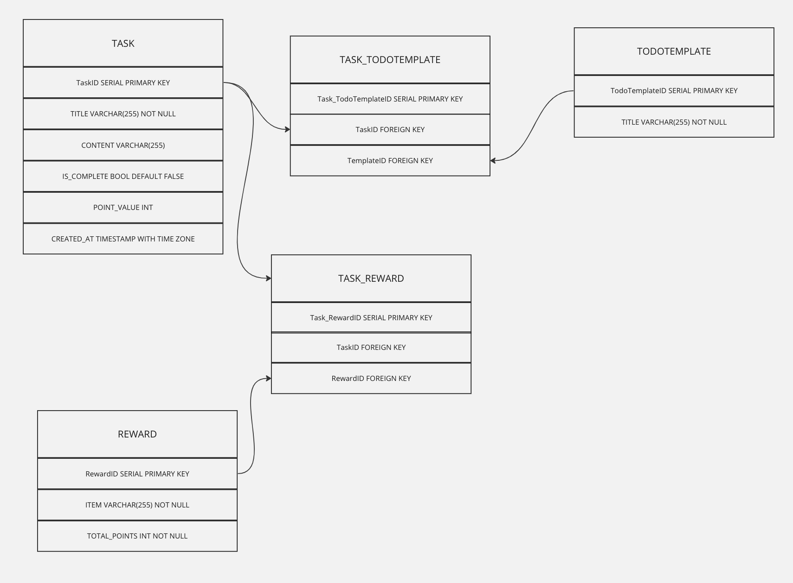
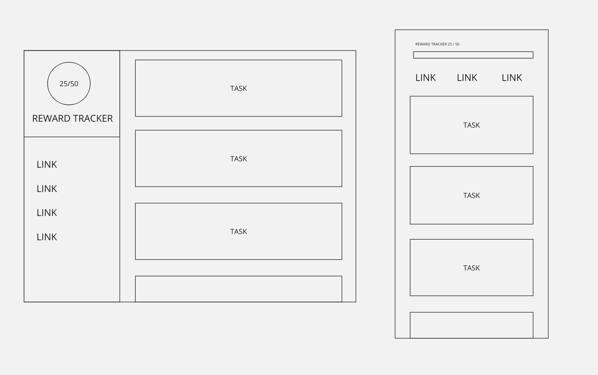

# todolist-2

## Overview
A simple To-Do application made with PERN stack (PostgreSQL, Express, React, Node.js). 

This application allows the user to create a list of to-do items and track progress towards a reward through a point system.

## DB Schema:

## Wireframe:

